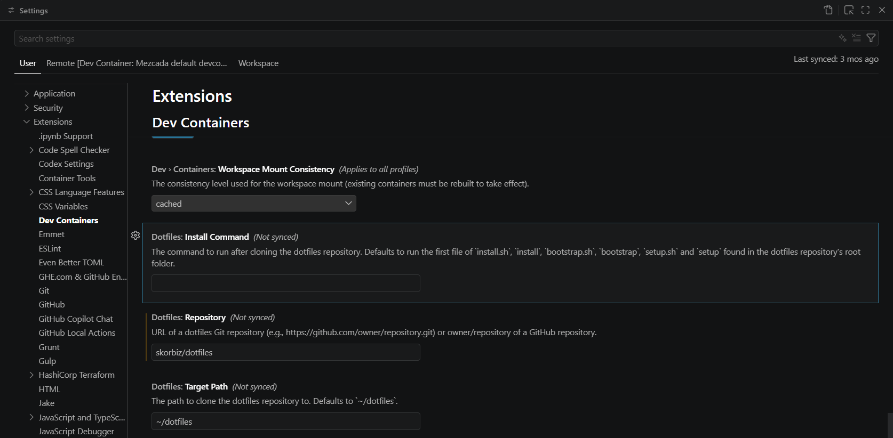

# Dotfiles
Small personal dotfiles setup.
Include setup for shell, git, qtile and vs-code.

## Setup
The setup is for use both in ubuntu with full window manager replacement and more locally in wsl, vs-code devcontainer or other terminal based setups.

### Manual Installation

Run the installation script:
```bash
cd ~/dotfiles
./install.sh
```

This will:
1. Install zsh and all plugins (oh-my-zsh, powerlevel10k, fzf, etc.)
2. Create symlinks for config files
3. Set up your environment

Then restart your shell (or log out and back in).

### VS Code Dev Containers
When using the VS Code Dev Containers extension, set this repo as your dotfiles repository. VS Code will clone/update it automatically, and your setup will re-run when you reload/rebuild the container.


In VS Code settings, set:

```json
{
   "dotfiles.repository": "skorbiz/dotfiles",
   "dotfiles.targetPath": "~/dotfiles",
}
```



The vs-code integration is inspired by: [kaspertofte/dotfiles](https://github.com/kaspertofte/dotfiles/tree/main)

## Tools

### Zsh
- **oh-my-zsh** - Framework for managing zsh configuration
- **powerlevel10k** - Fast, customizable prompt theme
- **zsh-autosuggestions** - Fish-like autosuggestions
- **zsh-syntax-highlighting** - Syntax highlighting for commands
- **zsh-z** - Directory jumper
- **fzf** - Fuzzy finder for command history and file search

### Bash
- Custom aliases in `.bash_aliases`

### Qtile
Window manager configuration (for full Ubuntu installations)

### Picom
Compositor configuration
